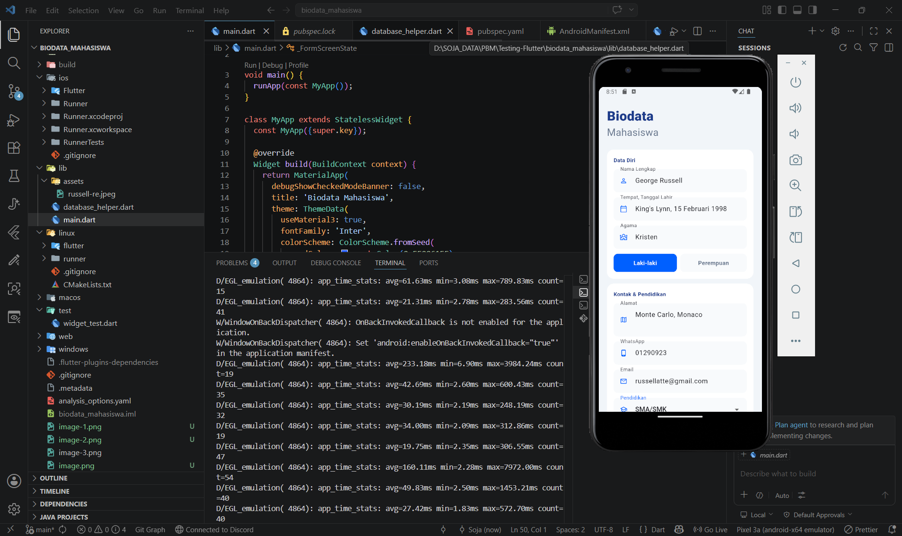
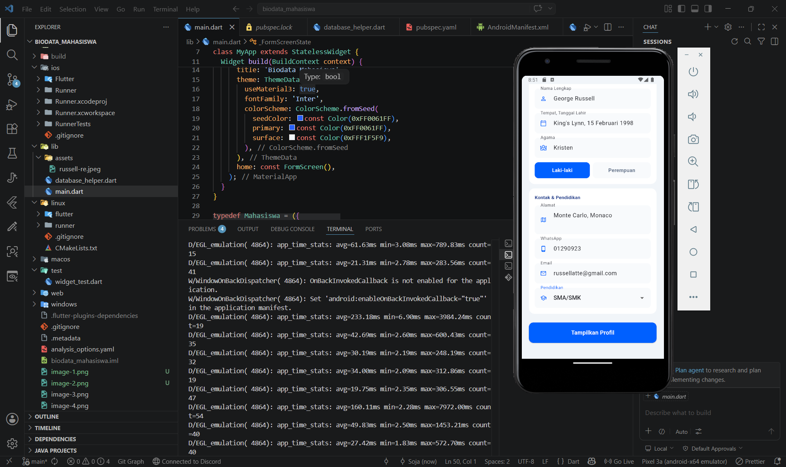
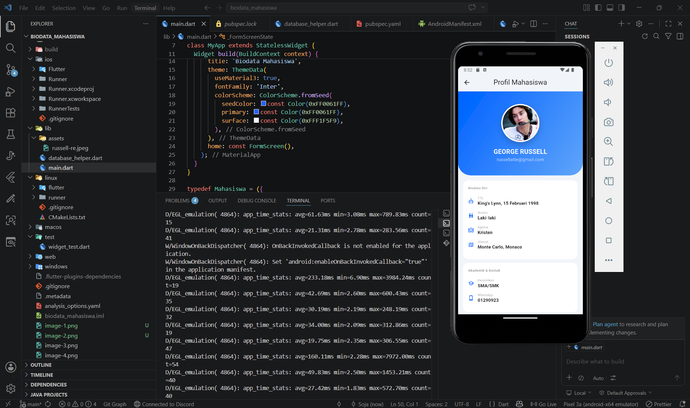
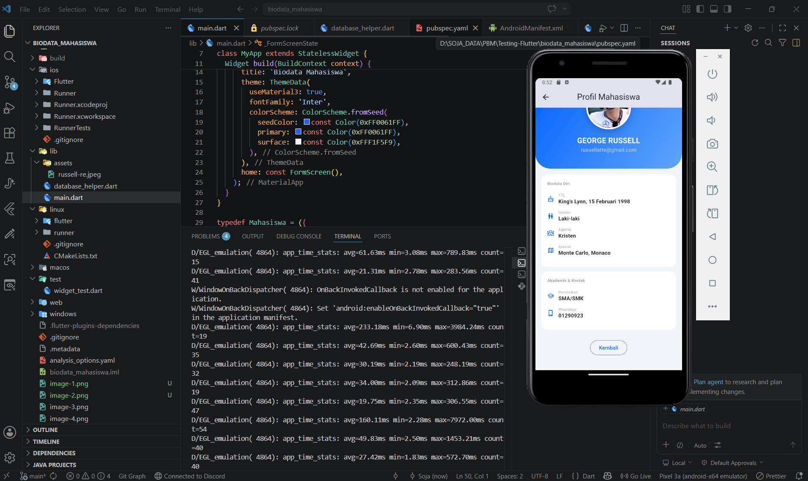

# Biodata Mahasiswa 🎓

Aplikasi Flutter sederhana untuk input dan menampilkan biodata mahasiswa dengan tampilan yang modern dan bersih. Dibuat menggunakan Material 3 untuk memenuhi tugas praktikum.

## ✨ Features

- Input Biodata Lengkap: Mulai dari nama, TTL, alamat, sampai kontak (WA/Email).
- Tampilan Profil : Hasil input ditampilkan dalam bentuk kartu profil.
- Validasi Form: Mencegah data kosong saat di-submit.

## Identitas Praktikan
- Nama: Soja Purnamasari
- NPM: 4523210104
- Mata Kuliah: Prak. Pemrograman Berbasis Web (B)

## 🚀 Getting Started

### Prerequisites

- [Flutter SDK](https://docs.flutter.dev/get-started/install)
- [Dart SDK](https://dart.dev/get-dart)
- An Android Emulator, iOS Simulator, or physical device.

### Installation

1. **Clone the repository**:

   ```bash
   git clone <repository-url>
   cd biodata_mahasiswa
   ```

2. **Get dependencies**:

   ```bash
   flutter pub get
   ```

3. **Run the application**:
   ```bash
   flutter run
   ```

## 🛠️ Tech Stack

- **Framework**: [Flutter](https://flutter.dev)
- **Language**: [Dart](https://dart.dev)
- **Design System**: Material 3
- **Fonts**: Inter (Google Fonts)

## 📸 Screenshots
---
## Input data & Tampilkan Profil

- 
- 
- 
- 
---
Developed with Flutter.
